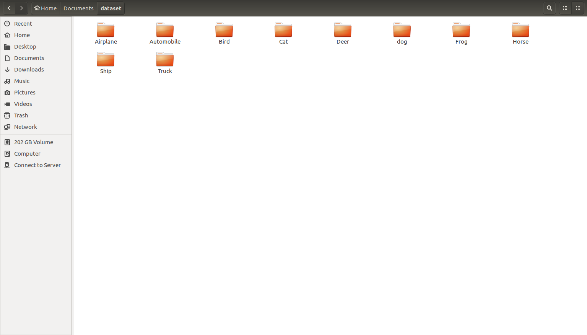

# Dataset to CIFAR
This package was created to process datasets of images (mainly for Machine Learning purposes) into the CIFAR-10 binary version format. With this package you can:

* Turn your image datasets into the **binary version** of the CIFAR-10 format
* Resize the images to a desire dimension before processing
* Split the image datasets into a desired number of batches. 

Please refer to the official website for [CIFAR-10](https://www.cs.toronto.edu/~kriz/cifar.html) for more information on how the data is formatted.


## Dependencies
```
pip install --upgrade Pillow
```

## How to use?
Images beloging to an specific class (i.e. Trees) need to get stored into separate directories where the name of the directory is the class label. 




## TODO:
* Test on python 2.7x
* Transform image datasets into CIFAR-10 python version and CIFAR-10 Matlab version
* Improve running time
